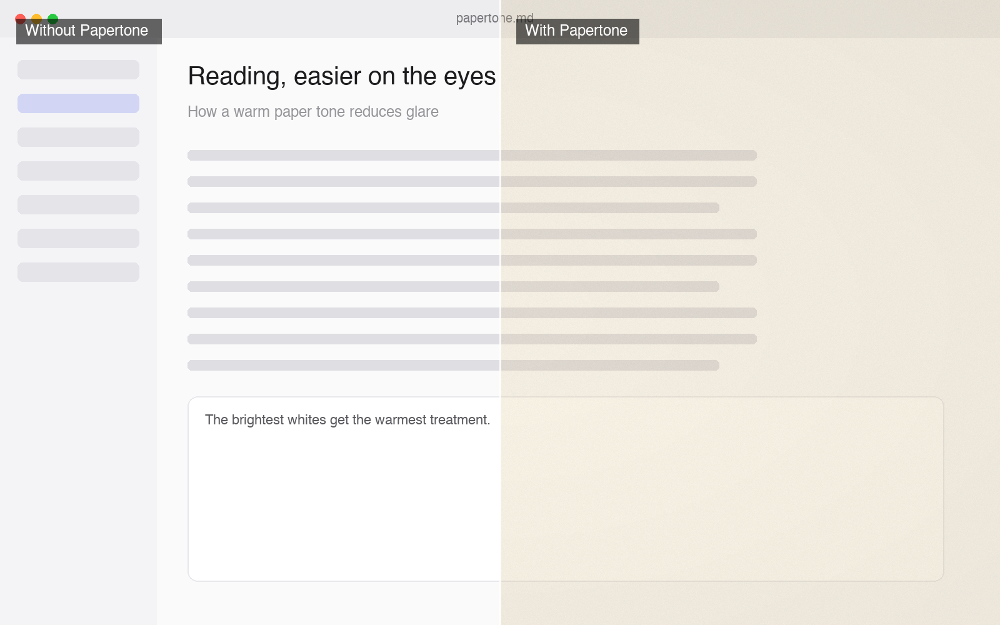
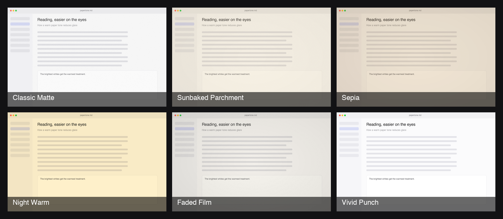

# Papertone

A warm, matte paper tone over your Mac's screen — softens glare and harsh
contrast so long sessions are easier on the eyes.



Papertone is a lightweight menu-bar app. It lays an adjustable, click-through
"paper" tone over every display, with presets ranging from a subtle matte to a
warm night mode. It stays out of your way — no Dock icon, no window unless you
open Settings — and turns itself off for apps that need true colour.

- Runs on all displays and Spaces, fully click-through
- Six built-in presets, plus your own custom looks
- Per-app exceptions (auto-off for design tools, etc.)
- Launch at login
- Signed with a Developer ID and notarized by Apple

---

## Presets



| Preset | What it does |
| --- | --- |
| **Classic Matte** | Neutral paper wash with fine grain |
| **Sunbaked Parchment** | Warmer cream tone, more grain |
| **Sepia** | Warm brown reading wash |
| **Night Warm** | Blue-light reduction via display gamma |
| **Faded Film** | Lifted blacks, grain, and vignette |
| **Vivid Punch** | A contrast curve for a crisper image |

Adjust **Intensity** to scale any preset, or open **Fine-tune** to set the
tint colour, grain, vignette, warmth, and contrast — then save it as your own
preset.

---

## Install

1. Download the latest `Papertone.dmg` from the
   [Releases](https://github.com/ZevnixAi-Applications/Papertone/releases/latest) page.
2. Open the DMG and drag **Papertone** into **Applications**.
3. Launch it. It appears in the menu bar — click the icon for presets and Settings.

Papertone is signed with a Developer ID and notarized by Apple, so it opens
without "unidentified developer" warnings. Requires **macOS 13 or later**.

---

## Usage

- **Menu bar** — toggle the effect on/off and switch presets in one click.
- **Settings** — Intensity, Fine-tune controls, custom presets, per-app
  exceptions, and Launch at login.
- **Per-app exceptions** — add an app (e.g. Figma, Photoshop) and the effect
  turns off automatically while that app is in front, so colour stays accurate.

---

## How it works

Papertone combines two adjustable layers:

- **Overlay** — a transparent, click-through window composites a warm tint,
  paper grain, and a vignette on top of the screen.
- **Display curve** — for warmth, contrast, and faded looks, it adjusts the
  display's gamma tables (the same mechanism as Night Shift).

Because it uses the display gamma, Papertone is distributed directly (Developer
ID + notarization) rather than through the Mac App Store, whose sandbox blocks
that access.

Note: no third-party app can change true **saturation**, grayscale, or hue on
the whole display — macOS reserves that for Accessibility. "Vivid Punch" is a
contrast curve, not a saturation boost.

---

## Build from source

Requirements: macOS 13+, Xcode 26+, and [XcodeGen](https://github.com/yonatanp/XcodeGen)
(`brew install xcodegen`).

```sh
git clone https://github.com/ZevnixAi-Applications/Papertone.git
cd Papertone
./build.sh        # generates the project, builds, installs to /Applications, launches
```

The Xcode project is generated from `project.yml` by XcodeGen and is not
committed — run `xcodegen generate` (or `./build.sh`) after cloning. To open in
Xcode: `xcodegen generate && open Papertone.xcodeproj`.

## Release

`RELEASE.md` documents the Developer ID signing + notarization pipeline. Once
the certificate and notary credentials are set up, one command builds a
distributable image:

```sh
./release.sh      # sign, notarize, staple, and produce dist/Papertone.dmg
```

## Uninstall

Quit Papertone from the menu bar, then move `/Applications/Papertone.app` to the
Trash. Preferences are stored under the `com.zevnix.papertone` user defaults.

## Roadmap

- Scheduling — auto on/off by time
- Dim below the system minimum brightness
- Per-app profiles and a global hotkey
- Control Center toggle

---

Made by Zevnix AI Pvt Ltd. © 2026.
